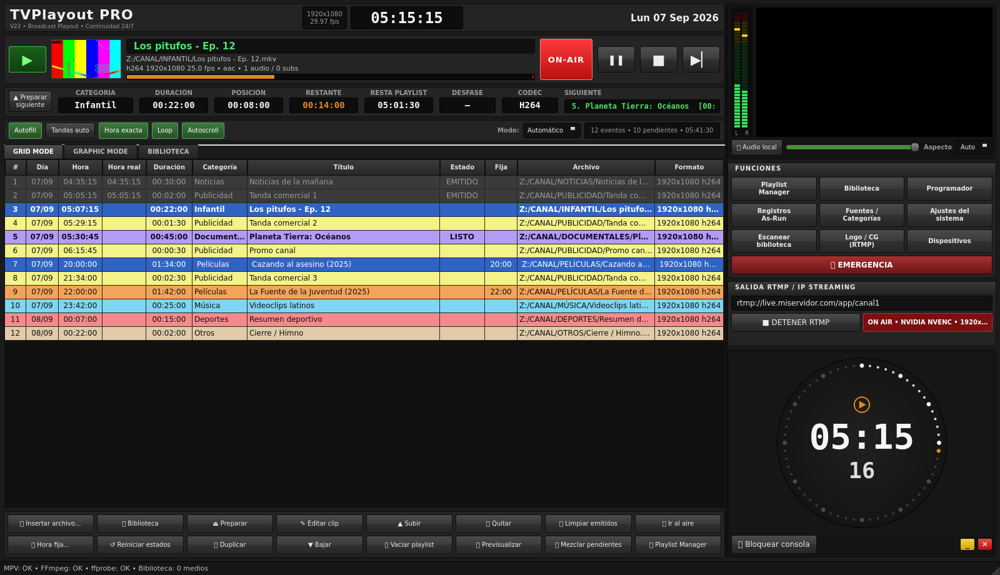

# TVPlayout PRO V23.3 — Consola de playout 

Playout de televisión 24/7 para Windows con interfaz inspirada en la distribución de **XPlayout** (Axel Technology),
sin usar código ni recursos propietarios. Reproductor local **mpv** embebido + salida **RTMP/SRT/UDP** con **FFmpeg**.



## Distribución del panel

| Zona | Contenido |
|---|---|
| Cabecera | Título, resolución/fps de salida, reloj principal, fecha |
| Transporte | ▶ PLAY · ❚❚ PAUSA (solo local) · ■ STOP · ▶▏ SIGUIENTE · miniatura · nombre/ruta/formato del clip · barra de progreso · indicador **ON-AIR** |
| Contadores | CATEGORÍA · DURACIÓN · POSICIÓN · RESTANTE (naranja, rojo en los últimos 10 s) · RESTA PLAYLIST · DESFASE · CODEC · SIGUIENTE |
| Modos | Autofill · Tandas auto · Hora exacta · Loop · Autoscroll · Modo Automático/Manual |
| GRID MODE | Playlist con filas coloreadas por categoría: #, Día, Hora (estimada), Hora real, Duración, Categoría, Título, Estado, ⏰ hora fija, Archivo, Formato. Fila azul = AL AIRE, lila = LISTO (cue), gris = emitido |
| GRAPHIC MODE | La misma playlist con miniaturas |
| BIBLIOTECA | Buscador + filtro por categoría, añadir al final / tras el aire / en selección / emitir ahora |
| Botonera | Insertar archivo, Preparar, Editar clip, Subir/Bajar, Quitar, Limpiar emitidos, Ir al aire, Hora fija, Reiniciar estados, Duplicar, Vaciar, Previsualizar, Mezclar pendientes, Playlist Manager |
| Monitor | VU meter estéreo (dBFS) + vídeo mpv embebido, volumen/mute **solo local**, aspecto |
| FUNCIONES | Playlist Manager · Biblioteca · Programador · Registros As-Run · Fuentes/Categorías · Ajustes del sistema · Escanear · Logo/CG (RTMP) · Dispositivos · 🚨 EMERGENCIA |
| SALIDA RTMP | URL, INICIAR/DETENER, estado (encoder, resolución, bitrate) |
| Reloj de estación | Anillo de 60 segundos + HH:MM / SS, bloqueo de consola, minimizar/salir |

Atajos: **F1** Play · **F2** Pausa · **F3** Stop · **F4** Siguiente · **F5** Preparar · **Supr** quitar · **Ctrl+↑/↓** mover ·
**Ctrl+F** buscar en biblioteca · **Ctrl+L** bloquear · **F11** pantalla completa. Doble clic en una fila = emitir ahora.
Se pueden **arrastrar archivos o carpetas** desde el Explorador a la grid.

## Continuidad

- **Automático**: al terminar un evento pasa al siguiente pendiente. **Manual**: se detiene y deja el siguiente en LISTO esperando PLAY.
- **Hora exacta**: los eventos con hora fija (⏰) cortan lo que esté al aire a su hora; la columna DESFASE muestra el retraso real.
- **Loop**: al acabar la playlist vuelve a empezar. **Autofill**: rellena con medios aleatorios de la categoría configurada.
- **Tandas auto**: inserta N anuncios (categoría Publicidad) después de cada evento que no sea publicidad.
- **Emergencia**: emite de inmediato el clip de emergencia configurado (se pide la primera vez).
- La playlist actual se guarda sola y se restaura al abrir; opción de **poner al aire automáticamente** e **iniciar RTMP** al arrancar.
- **As-Run log**: todo lo emitido queda registrado (inicio, fin, estado EMITIDO/CORTADO/ERROR) y se exporta a CSV.

## Salida RTMP

La salida sigue al playout local: cada vez que empieza un evento en mpv, FFmpeg salta al mismo evento. Se emite clip por clip
sobre la misma URL (el servidor ve una reconexión breve entre clips). Encoders: AUTO (prueba NVENC → QSV → AMF → x264),
CPU/x264, NVIDIA NVENC, Intel QSV, AMD AMF. Audio AAC 48 kHz estéreo, pista de audio elegida por preferencia
(es-MX / es-419 / Latino / spa / es…). Opcional: quemar subtítulos preferidos y superponer un **logo PNG** (posición, tamaño,
opacidad). También acepta `srt://` y `udp://`.

## Instalación (Windows)

1. Instala **Python 3.13 x64** (o 3.11/3.12).
2. Ejecuta `INSTALL.bat` (crea `.venv` e instala PySide6 6.8.3).
3. Copia `mpv.exe` en `mpv-x86_64\` (build de mpv para Windows x86_64).
4. Copia `ffmpeg.exe` y `ffprobe.exe` en la raíz del proyecto (o en `ffmpeg\bin\`, `bin\`).
5. Ejecuta `INICIAR.bat` (`INICIAR_CONSOLA.bat` para ver mensajes de depuración).

Opcional: archivo `.env` con `MPV_PATH=...`, `FFMPEG_PATH=...`, `FFPROBE_PATH=...`, `TVPLAYOUT_DB=...`.

Primer uso: **Fuentes / Categorías** → añadir carpetas (locales o UNC) → **Escanear biblioteca**. Con ffprobe se analizan
duración, resolución, códecs, pistas de audio/subtítulos y se generan miniaturas (en `cache\thumbs`).

## Estructura

```
main.py                 punto de entrada
app/main_window.py      consola principal (layout XPlayout)
app/playout.py          controlador de continuidad (auto/manual, cue, hora fija, loop, autofill, tandas)
app/mpv_player.py       mpv embebido por IPC (named pipe / socket), VU meter
app/output.py           motor RTMP/SRT/UDP con FFmpeg (sigue al playout local, logo, subtítulos)
app/prober.py           ffprobe: metadatos, pistas, miniaturas; selección de pista preferida
app/scanner.py          escaneo recursivo de fuentes
app/scheduler.py        programador diario/semanal/mensual/trimestral
app/db.py               SQLite: biblioteca, playlists, programaciones, ajustes, as-run
app/dialogs*.py         Playlist Manager, Fuentes, Programador, Registros, Ajustes, Logo, Dispositivos
app/widgets.py          reloj de estación, VU meter, superficie de vídeo, barra de progreso
app/theme.py            hoja de estilos oscura
tests/                  pruebas (python tests/test_core.py) y mpv simulado para pruebas
```

## Registro de cambios

### V23.3
- Filler automático + slate al fin de playlist: cuando no queda ningún clip por reproducir (sin loop, sin autofill),
  se carga en loop infinito un clip de filler configurado o, en su defecto, un slate estático generado en runtime,
  en vez de dejar el monitor en negro.
- Fix crítico: loop infinito de filler/slate que podía colgar el playout al llegar al fin de la lista.

### V23.0
- Crossfade de audio entre clips: fade-out del clip saliente y fade-in del entrante mediante el filtro
  `lavfi=afade` de mpv, con transición configurable (0.0s–3.0s).

### V22.1 / V22.2.x
- Sincronización de pausa y seek del playout local con la salida RTMP; watcher de drift entre ambos.
- Selector de modo RTMP (local/remoto) con chip de estado y reinicio automático ante fallos.
- Watchdog de fin de clip robusto y VU meter adaptado a las keys nuevas de mpv.
- Desactivación de `watch_later` y purga de `.cfg` de mpv al arrancar (fix del monitor en negro tras cada corte).
- Barra POSICIÓN/RESTANTE basada en reloj de pared cuando mpv no reporta `time-pos`.
- Panel de logs con colores y badge de errores/warnings en el statusBar.

### V22

- Rediseño completo de la interfaz al estilo XPlayout: cabecera con reloj, transporte, contadores, modos, grid coloreada,
  modo gráfico, biblioteca integrada, botonera, VU meter, monitor, funciones, salida RTMP y reloj de estación.
- Continuidad real: encadenado automático por eventos de mpv (fin de archivo), modo manual con cue, hora fija, loop,
  autofill, tandas, emergencia, bloqueo de consola, as-run log.
- mpv por IPC bidireccional: posición/duración en tiempo real, VU meter, pista de audio/subtítulos por evento.
- RTMP sincronizado con el playout local (mismo evento), logo PNG, subtítulos quemados opcionales, SRT/UDP.
- ffprobe en segundo plano: duración, formato, pistas, miniaturas. Filtro de audio español latino mejorado.
- Playlist Manager (guardar/cargar/renombrar/exportar/importar M3U/JSON), Fuentes con edición, Programador con próxima
  ejecución, Registros (as-run + sistema), Ajustes del sistema, Dispositivos.
- Ajustes persistentes en SQLite, restauración de playlist, arranque automático opcional.

### V21 / V20.x
- RTMP clip a clip, programador funcional, corrección de presets NVENC, playlist persistente (ver historial de git).
